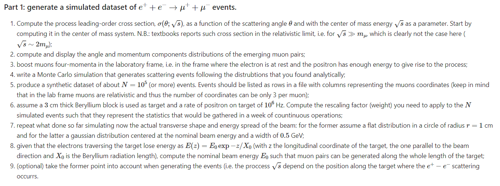

# Task Assigment 

**Presentation Line UP**

**Marium**
  -Introduce concept
  -introduce Differential and Total Cross Section
  -Introduce Probability Density Functions
  
**Daniel**
  -Inverse Sampling Technique
  -Simulation Results
  -Explain and Show Realistic Beam version of monete carlo

**Jake**
  -Introduce 4 momentua and boosting
  -Show Momentum Distribution before and after realistic beam considerations
**Walter**
  -Show Scaling Factor Calculation
  -Show Nominal Beam Energy Calculation

**Conclusion**
Place a few main graphs and highlight main ideas presented. 

**Part 9, may or may not be fitted in after walters bit**

Mariam 1 & 2  
Daniel 4  
Jake 3 & 5  
Walter 6

Task 7 looks quite big and we don't understand it so we will work how to do it later. 
Task 8 looks okay, we can assign it later.
Task 9 optional but looks okay. 

In each of the branches of this repo you find all the necessary to complete your final project.
In particular the file Project.ipynb describes the projects and provides guidance to its development.
Other files could be present if needed.

Each branch is named after the group of students a given project is assigned to.
The groups compositions are listed [here](https://docs.google.com/spreadsheets/d/1u1WuXA8fawn73KVtnbTuEZekwOFmCO7cSuUoayZHq9s/)

Students are supposed to work together to produce a short report on the assigned task. The preferred format for the latter is a jupyter notebook, with the proper description, the code implemented for the purpose and the actual results (plots, tables, etc.). The notebook has to be delivered with all the cells executed and should live in a GitHib repository. There is no need to make a pull request to the central repository.

### Computing Resources

A Virtual Machine within [CloudVeneto](http://cloudveneto.it/) can be created for each group. Note that, by default, they are not. For some projects though, large datasets are needed, in those cases a VM has been (are being) created to store those files. Refer to ClouldInstructions.md for the steps to take in order to use those resources.

Alternatively, students can use [colab](https://colab.research.google.com/) (for which though no instructions are provided here).

